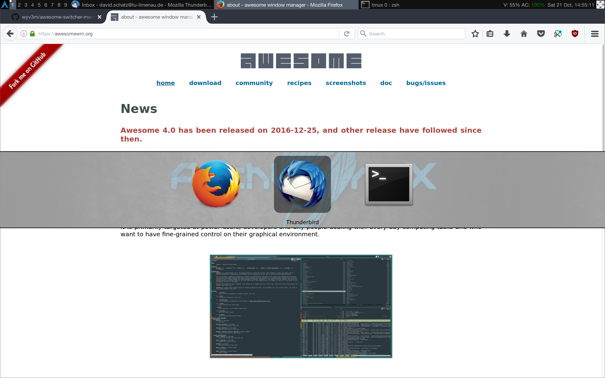

awesome-switcher-preview
========================

Integrate familiar Mac OS X Alt-Tab functionality in [awesome wm](https://github.com/awesomeWM/awesome).

Features:

* Icon view like on Mac OS X or live previews while alt-tabbing
* Easily adjustable settings
* No previews when alt-tab is released within some time-frame
* Backward cycle using shift
* Intuitive order, respecting your client history
* Includes minimized clients (in contrast to some of the default window-switching utilies)

Planned features:

* Optionally group different clients from the same application (e.g. multiple windows from Thunderbird) for alt-tab (to avoid confusion when only icons are used as preview)
* Switch between different clients from the same application with an additional key combination (e.g. alt-< and alt->)



## Installation ##

Clone the repo into your `$XDG_CONFIG_HOME/awesome` directory and add the
dependency to your `rc.lua`.
If `$XDG_CONFIG_HOME` is not set, the default is `$HOME/.config`.

```Shell
cd "$XDG_CONFIG_HOME/awesome"
git clone https://github.com/wyv3rn/awesome-switcher-macstyle.git
```

```Lua
local switcher = require("awesome-switcher-macstyle")
```

## Configuration ##

Optionally edit any subset of the following settings, the defaults are:

```Lua
switcher.settings.preview_box = true,                                 -- display preview-box
switcher.settings.preview_box_bg = "#ddddddaa",                       -- background color
switcher.settings.preview_box_border = "#22222200",                   -- border-color
switcher.settings.preview_box_fps = 30,                               -- refresh framerate
switcher.settings.preview_box_delay = 150,                            -- delay in ms
switcher.settings.preview_box_title_font = {"sans","italic","normal"},-- the font for cairo
switcher.settings.preview_box_title_font_size_factor = 1.0,           -- the font sizing factor
switcher.settings.preview_box_title_color = {0,0,0,1},                -- the font color

switcher.settings.cycle_raise_client = false,                         -- raise (bring to front) selected clients while tabbing
switcher.settings.swap_with_master = false,                           -- swap the selected client with the master client (equivalent to a subsequent "modkey + Control + Return" in default awesome keybindings)
```

Add key-bindings:
On my particular system, and I guess most, Shift-Tab is captured by the keygrabber as a single key, namely `ISO_LEFT_TAB`. Therefore, this is what my keybindings look like:

```Lua
awful.key({ "Mod1",           }, "Tab",
   function ()
       switcher.switch( 1, "Alt_L", "Tab", "ISO_Left_Tab")
   end),

awful.key({ "Mod1", "Shift"   }, "Tab",
   function ()
       switcher.switch(-1, "Alt_L", "Tab", "ISO_Left_Tab")
   end),
```

## Credits ##

The original plugin was created by [Joren Heit](https://github.com/jorenheit)
and later improved upon by [Matthias Berla](https://github.com/berlam).

Mac OS look and feel was done by [David Schatz](https://github.com/wyv3rn).

## License ##

See [LICENSE](LICENSE).
